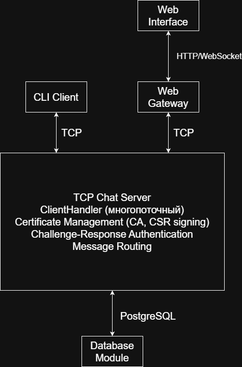

# Отчёт по лабораторным работам

## Курс: «Расширенные возможности языков высокого уровня»

**Студент:** [ФИО]  
**Преподаватель:** Борисов Артём Ильич  
**Ассистенты:** Лебедев Иван Игоревич, Парфенюк Дмитрий Александрович  
**Дата:** Весна 2025/26 уч. года

---

## Содержание

1. [Обоснование темы](#1-обоснование-темы)
2. [Обоснование проектных и архитектурных решений](#2-обоснование-проектных-и-архитектурных-решений)
3. [Описание архитектуры ПК](#3-описание-архитектуры-пк)
4. [Описание основных модулей и функций](#4-описание-основных-модулей-и-функций)
5. [Используемые технологии и библиотеки](#5-используемые-технологии-и-библиотеки)
6. [Тестирование](#6-тестирование)

---

## 1. Обоснование темы

### Выбор темы

**Тема проекта:** Разработка защищённого мессенджера с E2E-шифрованием и PKI-авторизацией

### Актуальность

В современном цифровом мире вопросы безопасности коммуникаций становятся критически важными:

- **Конфиденциальность сообщений** — пользователи ожидают, что их переписка не будет доступна третьим лицам
- **Аутентификация участников** — защита от impersonation атак
- **Защита от MITM** — предотвращение перехвата и модификации сообщений
- **Инфраструктура открытых ключей (PKI)** — стандарт де-факто для безопасной идентификации

### Почему выбран данный подход

1. **E2E-шифрование** — сервер не может расшифровать сообщения, только маршрутизирует
2. **PKI с CA** — централизованное управление доверием
3. **Challenge-Response** — доказательство владения приватным ключом
4. **Гибридное шифрование** — эффективность RSA + AES

---

## 2. Обоснование проектных и архитектурных решений

### Компонентная архитектура



### Почему такая архитектура

| Компонент | Выбор | Обоснование |
|-----------|-------|-------------|
| **Сетевой протокол** | TCP  | Надёжная доставка, контроль потока |
| **Формат пакетов** | JSON + header 4 bytes | Простота отладки, расширяемость |
| **Frontend (CLI)** | Python | Быстрая разработка, rich crypto libs |
| **Frontend (Web)** | FastAPI + HTML/JS | Асинхронность, WebSocket |
| **Backend** | Python + threading | Многопоточная обработка клиентов |
| **Database** | PostgreSQL | Надёжность, ACID, SQL |
| **Crypto** | cryptography (Python) | BoringSSL-based, audited |

### Паттерны проектирования

1**Thread-per-Client** — каждый клиент в отдельном потоке

---

## 3. Описание архитектуры ПК

### Компоненты системы

#### 3.1 Фронтенд (Пользовательский интерфейс)

**CLI Client** (`client/main.py`)
- Интерактивный терминальный интерфейс
- Команды: `/quit`, `/help`, `/list`, `/export_crt`, `/import_crt`
- Формат сообщений: `@nickname текст`

**Web Gateway** (`web_gateway/app.py`)
- FastAPI REST API
- WebSocket для real-time событий
- HTML/CSS/JS интерфейс

#### 3.2 Модуль взаимодействия с БД

**Server Database Module** (`server/main.py`)
```python
class ChatServer:
    def _init_db(self)         # Создание таблицы certificates
    def _get_cert_from_db()    # Получение сертификата по nickname
    def _save_cert_to_db()      # Сохранение сертификата
```

#### 3.3 База данных

**PostgreSQL Database: `chat_db`**

Таблица `certificates`:
```sql
CREATE TABLE certificates (
    nickname VARCHAR(255) PRIMARY KEY,
    cert_pem TEXT NOT NULL,
    created_at TIMESTAMP WITH TIME ZONE DEFAULT CURRENT_TIMESTAMP
)
```

#### 3.4 Бэкенд

**TCP Chat Server** (`server/main.py`)
- Многопоточная обработка клиентов (`ClientHandler`)
- PKI-операции (CA, CSR, сертификаты)
- Challenge-Response авторизация
- Маршрутизация E2E-сообщений

#### 3.5 Модуль сетевого взаимодействия

**Протокол передачи данных:**
```
[4 байта: длина] [JSON payload UTF-8]
```

**Типы пакетов:**
- `cert_enroll` / `cert_enroll_response` — выпуск сертификата
- `auth_init` / `auth_challenge` / `auth_proof` — авторизация
- `key_request` / `key_response` — обмен ключами
- `message` — E2E-сообщение
- `event` — системные события
- `error` — ошибки

#### 3.6 Функциональные модули

**Криптографический модуль:**
- Генерация RSA-ключей
- Создание и подпись CSR
- Валидация сертификатов
- E2E-шифрование (RSA + AES-GCM)
- Challenge-Response подпись

---

## 4. Описание основных модулей и функций

### 4.1 Server (`server/main.py`)

#### Класс `Packet`
```python
class Packet:
    VERSION = 1

    def to_dict()          # Сериализация в dict
    def to_json()          # Сериализация в JSON
    @classmethod from_json() # Десериализация из JSON
    @staticmethod create_event() # Создание события
```

#### Класс `ClientHandler`
```python
class ClientHandler:
    def start_listening()      # Цикл чтения из сокета
    def send_packet()          # Отправка пакета клиенту
    def handle_packet()        # Обработка входящих пакетов
    def disconnect()            # Корректное отключение
```

#### Класс `ChatServer`
```python
class ChatServer:
    def __init__()              # Инициализация сокета, CA, БД
    def _init_db()             # Создание таблицы сертификатов
    def validate_client_certificate() # Валидация сертификата клиента
    def issue_client_certificate()   # Выпуск сертификата по CSR
    def verify_client_signature()     # Проверка подписи challenge
    def get_online_users()      # Список онлайн пользователей
    def send_to_user()          # Отправка пакет конкретному пользователю
    def broadcast()             # Рассылка всем клиентам
    def start()                 # Запуск сервера
```

### 4.2 Client (`client/main.py`)

#### Класс `ChatClient`
```python
class ChatClient:
    def connect()               # Подключение к серверу
    def authenticate()         # Авторизация (с автовыпуском сертификата)
    def send_message()          # Отправка E2E-сообщения
    def _encrypt_for_recipient() # E2E-шифрование
    def _decrypt_message()      # E2E-дешифрование
    def _export_crt()           # Экспорт сертификата
    def _import_crt()           # Импорт сертификата
    def disconnect()            # Отключение
    def run_interactive()       # Интерактивный режим
```

### 4.3 Web Gateway (`web_gateway/`)

#### `app.py` — FastAPI приложение
```python
@app.post("/api/connect")       # Подключение к чату
@app.post("/api/send")          # Отправка сообщения
@app.post("/api/disconnect")    # Отключение
@app.post("/api/export_crt")     # Экспорт сертификата
@app.post("/api/import_crt")     # Импорт сертификата
@app.get("/api/events")         # Получение событий
@app.get("/api/state")          # Состояние клиента
@app.websocket("/ws")            # WebSocket поток событий
```

#### `chat_core.py` — Общая логика клиента
- Идентичен `client/main.py` но без CLI
- Callback-based событийная модель

---


## 5. Используемые технологии и библиотеки

### Сервер

| Библиотека | Версия | Назначение |
|------------|--------|------------|
| `cryptography` | — | Криптографические операции (RSA, AES, X.509) |
| `psycopg2-binary` | — | PostgreSQL драйвер |
| `python-dotenv` | — | Переменные окружения |
| `socket` | stdlib | TCP-сокеты |
| `threading` | stdlib | Многопоточность |

### Клиент

| Библиотека | Версия | Назначение |
|------------|--------|------------|
| `cryptography` | — | E2E-шифрование, PKI |
| `socket` | stdlib | TCP-соединение |

### Web Gateway

| Библиотека | Версия | Назначение |
|------------|--------|------------|
| `fastapi` | — | REST API фреймворк |
| `uvicorn` | — | ASGI сервер |
| `pydantic` | — | Валидация данных |
| `cryptography` | — | Криптография (reused from chat_core) |

### База данных

| Система | Назначение |
|---------|------------|
| **PostgreSQL** | Хранение выданных сертификатов |

---


## 6. Тестирование

### Подход к тестированию
Для обеспечения надёжности системы разработана комплексная система автоматизированного тестирования на базе фреймворка `pytest`. Тесты охватывают все уровни приложения: от сериализации пакетов до сквозных сценариев взаимодействия клиента и сервера.

### Основные тестовые модули

| Файл | Область тестирования |
|------|----------------------|
| `test_packet.py` | Валидация формата пакетов, корректность JSON-сериализации. |
| `test_client_logic.py` | Парсинг команд CLI, управление состоянием клиента. |
| `test_server_logic.py` | Логика PKI (выпуск сертификатов), обработка очередей сообщений. |
| `test_crypto_export.py` | Криптографические функции, экспорт/импорт ключей и сертификатов. |
| `test_error_handling.py` | Обработка исключительных ситуаций и некорректных данных. |
| `test_client_integration.py` | Интеграционные тесты взаимодействия клиента с эмулятором сервера. |
| `test_server_integration.py` | Интеграционные тесты сервера с эмулированными клиентами. |

### Результаты выполнения тестов

Все компоненты системы проходят автоматизированную проверку. Ниже представлен отчёт о выполнении 39 тестов:

```text
tests\test_client_extra.py ...                                     [  7%]
tests\test_client_integration.py ..                                [ 12%]
tests\test_client_logic.py ....                                    [ 23%]
tests\test_crypto_export.py ............                           [ 53%]
tests\test_error_handling.py ....                                  [ 64%]
tests\test_packet.py ....                                          [ 74%]
tests\test_server_extra.py ...                                     [ 82%]
tests\test_server_integration.py ...                               [ 89%]
tests\test_server_logic.py ....                                    [100%]

========================== 39 passed in 6.40s ===========================
```

---


*Отчёт подготовлен на основе методических указаний по курсу «Расширенные возможности языков высокого уровня»*